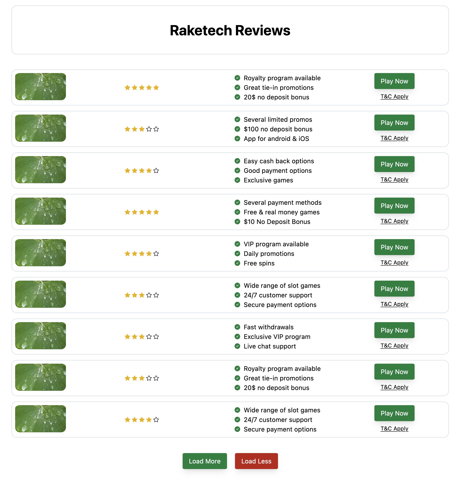

# Raketech Review Application

This project is a React application built with Next.js, TypeScript, and Tailwind CSS. It fetches data from a local WordPress REST API and displays reviews. The app is responsive and suitable for mobile and desktop. The application is focused on providing detailed reviews of different brands, with a "Load More" functionality.

## Features

- Fetches data from the WordPress REST API
- Displays reviews in a responsive list
- Each review includes an image, rating, features, terms and conditions, and a 'PLAY NOW' button
- A "Load More" and "Load Less" button are implemented, which adds 3 more brands to the list upon clicking
- Notifies users when all brands have been loaded
- Wordpress hosted on 000webhostapp.com [000webhostapp](https://www.000webhost.com)
- The app is deployed using [Vercel](https://vercel.com)
## Getting Started

Before running the project, you need to have the following installed:

- Node.js
- npm
- Next.js
- WordPress 
### Installing

1. Clone the repository: `git clone https://github.com/requiemcreatif/raketech-review-v1.git`
2. Navigate into the project directory: `cd raketech-review-v1`
3. Install the dependencies: `npm install`
4. Start the development server: `npm run dev`

## Built With

- [Next.js](https://nextjs.org/)
- [React](https://reactjs.org/)
- [TypeScript](https://www.typescriptlang.org/)
- [Tailwind CSS](https://tailwindcss.com/)
- [Axios](https://axios-http.com/)
- [Js-cookies](github.com/js-cookie/js-cookie)

## Authors

- Alain Mani  - [requiemcreatif](https://github.com/requiemcreatif)

# raketech-review-v1
[Raketech Review App](https://raketech-review-v1.vercel.app)